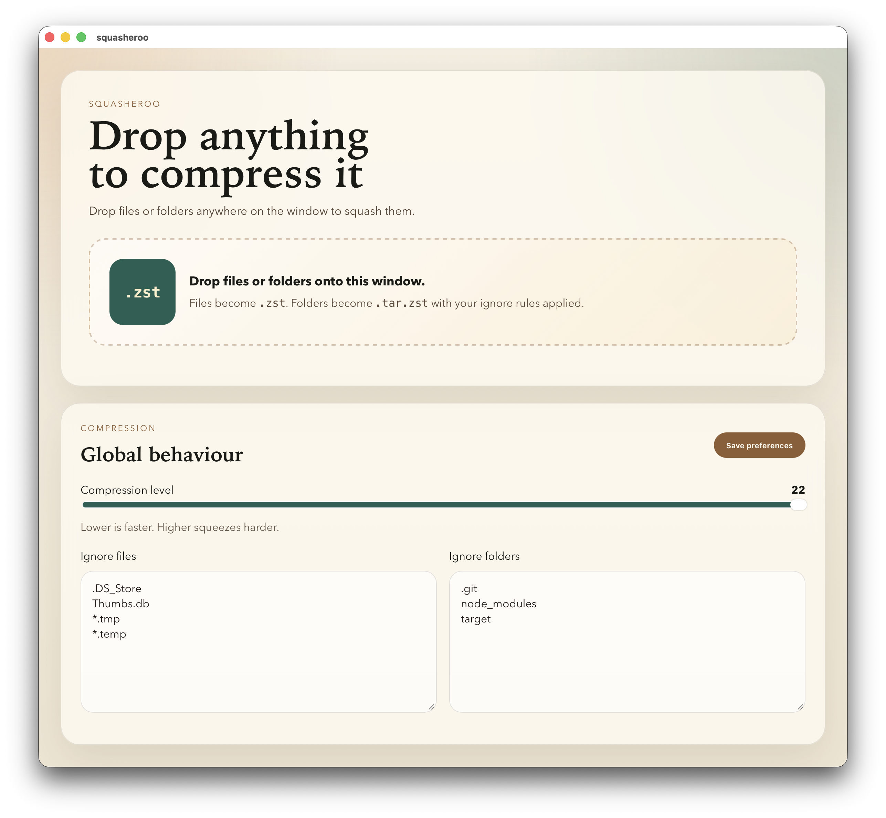

# squasheroo

<p align="center">
  
</p>
<h2 align="center">
  "Would you like a cup of tea?"
</h2>

<hr>


`squasheroo` is a small Tauri + Vue desktop app for macOS that compresses files and folders you drag onto the window, and keep global ignore rules in one place.

<p align="center">
  
</p>

It currently uses zstd for compression:
- Dropped files are written as `filename.ext.zst`
- Dropped folders are archived and compressed as `folder.tar.zst`

The app also includes:
- A global compression level control
- Global ignore lists for files and folders
- Persistent settings stored in the app config directory

## How It Works

1. Launch the app.
2. Adjust the compression level if needed.
3. Add file or folder patterns to the ignore lists.
4. Save preferences.
5. Drag files or folders onto the window.

Ignored files and folders are skipped during compression. If an output file already exists, the app creates a new name such as `report.txt (1).zst`.

## Ignore Rules

Ignore lists support simple glob-style patterns.

Examples:
- Files: `.DS_Store`
- Files: `*.tmp`
- Files: `build/*.map`
- Folders: `.git`
- Folders: `node_modules`
- Folders: `build/cache`

Folder ignore rules apply inside dropped directories before the archive is created.

## Requirements

- macOS
- Node.js with `pnpm`
- Rust toolchain
- A local zstd library available to the Rust build

The Tauri build links zstd statically from your machine. By default it looks in common Homebrew locations:
- `/opt/homebrew/Cellar/zstd/...`
- `/usr/local/Cellar/zstd/...`

If your zstd install lives somewhere else, set:

```bash
export ZSTD_LIB_DIR=/path/to/zstd/lib
```

## Development

Install frontend dependencies:

```bash
pnpm install
```

Run the app in development:

```bash
pnpm tauri dev
```

Useful commands:

```bash
pnpm test
pnpm build
cd src-tauri && cargo test --offline
```

## Project Structure

- `src/`: Vue frontend
- `src-tauri/src/`: Rust backend and Tauri commands
- `src/settings.ts`: frontend settings normalization helpers
- `src-tauri/src/lib.rs`: settings persistence, ignore handling, archive creation, and zstd compression

## License

This project is licensed under the MIT License. See `LICENSE`.

## Current Notes

- Compression work runs in Rust, not through external CLI commands.
- The UI is designed around drag-and-drop; there is no file picker flow yet.
- The app is currently focused on macOS first.
